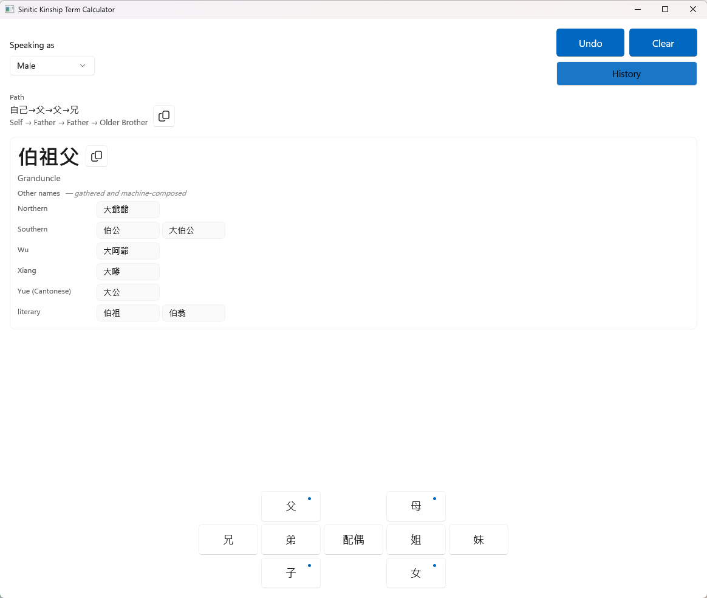
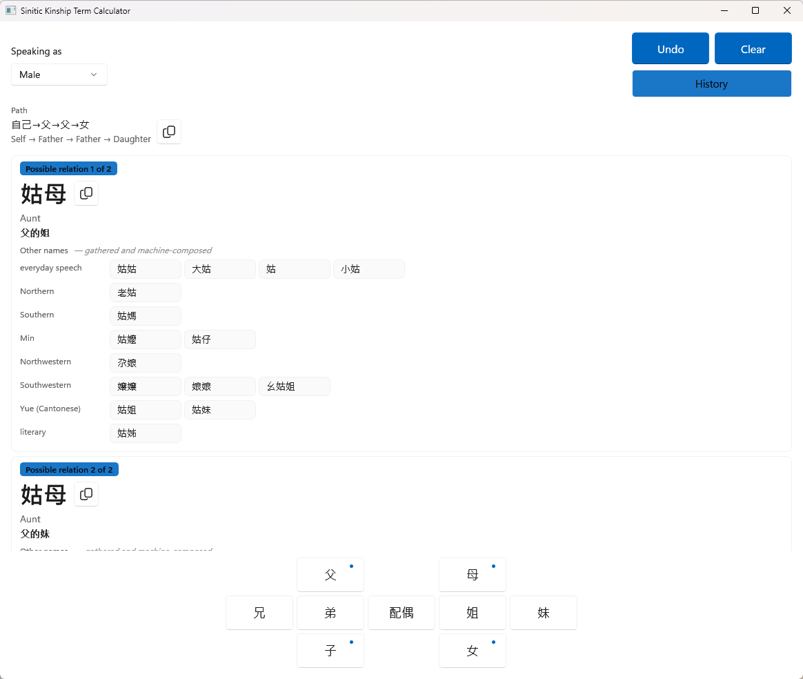

# Sinitic Kinship Term Calculator

[](LICENSE)

Click `father · father · elder-brother` and it tells you the person is your **伯祖父** — and that
southern speakers say **伯公**, northern speakers say **大爺爺**, and how to phrase it in a legal
document.

A WinUI 3 desktop application on .NET 10. Single-file, portable.

## Showcase



*One tap per hop on a family-tree keypad. `father · father · elder-brother` resolves to **伯祖父**
(Granduncle), and every recorded name for the same person sits under the register or region it
comes from — Northern, Southern, Wu, Xiang, Yue (Cantonese), literary.*



*`father · father · daughter` is genuinely ambiguous — grandfather's daughter may be father's elder
or younger sister. The engine returns **both** 姑母 readings and separates them with the documentary
chains 父的姐 and 父的妹 instead of silently picking one.*


*Keys with a dot carry variants, phone-keyboard style: right-click or press-and-hold 父 and the
same tap can land 養父 (adoptive) or 繼父 (step) instead.*

---

## Standing on prior work

This project would not exist without **[mumuy/relationship](https://github.com/mumuy/relationship)**
(MIT). It is, as far as we know, the most complete openly available treatment of Sinitic kinship
terminology: tens of thousands of relation chains, carefully collected regional variants, and a
working calculator that a great many people have found genuinely useful. Credit where it is due —
that corpus is the foundation everything here was built on.

**What mumuy contributes:** an extensive, curated corpus of kinship terms, resolved through a
precomputed lookup table (`mode-map.json`, ~20 MB). Give it a relation chain, it returns the term.

**What this project adds on top:**

| | mumuy | this project |
|---|---|---|
| How a term is produced | looked up in a precomputed table | **derived at runtime** from morphological rules |
| Deep chains (6+ hops) | table entry, or nothing | **composed** — 87% of 90,042 chains generated, not looked up |
| Regional variants | mixed into the answer set | **separated into swappable layers**, each labelled with its origin |
| Register | one answer | **four simultaneous readings** (standard / colloquial / documentary / raw) |
| Extending it | edit the source data | **drop a YAML file next to the executable** |

The relationship is incremental, not competitive. We read mumuy's output, inferred the
word-formation laws behind it, and rebuilt those laws as a generative engine — so the program
*computes* the term rather than remembering it. See [ATTRIBUTION.md](ATTRIBUTION.md) for exactly
what came from where, and for an honest account of what we did **not** manage to cover.

## Language policy

Kinship terms — the content — render in Traditional Chinese characters throughout. Everything
around them is English: the interface chrome, the source tags (Standard Mandarin, Northern,
Yue (Cantonese) and the rest), this README, and every engineering document in the repository.
There is no language switch. The English relation name under each term and the English path
line are fixed companions of the content, not a translation mode.

## Four simultaneous readings

One relationship, four ways to say it. **The selected answer is always Standard Mandarin**; the rest
are candidates.

| Layer | Example for `father · father · elder-brother` | Purpose |
|---|---|---|
| **Standard** | 伯祖父 | The answer. Nationally current, usable in writing |
| **Colloquial / regional** | 伯公 *(Southern)* · 大爺爺 *(Northern)* | Candidates, grouped under the source layer they come from |
| **Documentary** | 父的父的兄 | Legal-document phrasing, never contracted. Shown when it is the one thing separating two same-named readings |
| **Path readback** | 自己→父→父→兄 · Self → Father → Father → Elder Brother | Your input read back, so you can confirm the machine understood you |

The readback earns its place whenever simplification happens: enter
`mother · elder-brother · mother` and the engine resolves **外祖母**, while the path line still
reads **自己→母→兄→母** — one glance confirms nothing was misread.

## Regional variants are pluggable data, not hard-coded strings

The rule layer contains **only the word-formation machinery**. Every term that must be *looked up*
lives in YAML:

```
Resource/Data/Lexicon/
  lexicon-standard.yaml     standard terms no rule can derive (公公 / 岳父 / 親家公)
  register-colloquial.yaml  nationwide colloquial (爺爺 / 伯伯 / 阿姨)
  register-literary.yaml    書面 and classical (世父 / 仲父 / 彌甥 / 再從父)
  dialect-north.yaml        northern (姥姥 / 大爺爺 / 丈母娘)
  dialect-northwest.yaml    north-western (尕娘 / 婆姨 / 外爺)
  dialect-southwest.yaml    south-western (幺爺 / 婆娘 / 姑爹)
  dialect-xiang.yaml        Xiang (娭毑 / 大嗲 / 毑公)
  dialect-wu.yaml           Wu (大姆媽 / 娘舅 / 小娘)
  dialect-min.yaml          Min (依姆 / 恩伯 / 阿妗)
  dialect-yue.yaml          Cantonese (老竇 / 家嫂 / 太公)
  dialect-hakka.yaml        Hakka
  dialect-south.yaml        southern, undifferentiated (伯公 / 姑婆 / 外婆)
```

Twelve layers, 161 standard forms, 785 variant entries. Every one of them is machine-checked to
actually surface: a word registered against a key the engine never emits would load, validate and
reverse-look-up perfectly while no query could ever reach it, which is indistinguishable from a
relation that simply has no everyday word. A verification sweep drives the calculator over a
declared chain corpus and requires each shipped entry to appear in real output, in **both**
scripts — a Hans-only entry leaves Hant readers with a blank column.

They ship **next to the executable** in a `Lexicon` folder. Edit them, or add your own:

```yaml
meta:
  id: dialect-mine
  name: My Region
variants:
  伯祖父: [大爹爹]
```

A file that reuses a built-in `id` replaces that layer; a new `id` stacks alongside it. The same
layers are also embedded in the assembly, so deleting the folder degrades gracefully rather than
breaking the application.

### The layer format (extension API)

A layer is a small YAML file with a `meta` block and one or both of:

- **`variants`** — the common case. Alternate spellings keyed by the *standard* form; the standard
  term stays the primary answer, your spellings become tagged candidates.
- **`variants_male`** / **`variants_female`** — the same, but only offered to an ego of that
  gender. Needed wherever one standard form covers two people: `配偶` is a single gender-neutral
  word, so a flat list would hand 老公 and 老婆 to the same person. An ego of unknown gender gets
  the neutral list only — offering both is worse than offering neither.
- **`entries`** — a standard term the engine cannot derive (e.g. `公公`), keyed by relation chain
  and ego gender. Usually only the base layer needs this.

```yaml
meta:
  id: dialect-mine        # reuse a built-in id to override it; a fresh id stacks alongside
  name: My Region         # shown on the candidate chip: 大爹爹 · My Region
  layer: dialect          # base | register | dialect
variants:
  伯祖父: [大爹爹]         # key = standard form the engine produced; value = your local spellings
  外祖母: [阿嫲]
```

A ready-to-edit `Lexicon/sample-region.yaml.txt` ships next to the executable — copy it, rename it
to `.yaml`, and it loads on the next start-up.

This design has a history worth admitting: an early version of this project hard-coded one region's
colloquial forms (`伯公`) as the *primary* answer, displacing standard `伯祖父` — and you could not
change it without recompiling. Finding that led to the current rule: **anything looked up belongs in
data; only what can be computed stays in code.**

## Why this is not — and cannot be — "complete"

Past a shallow core, Sinitic kinship naming is an **open system**, and that has a precise
consequence worth stating plainly instead of papering over with a large number.

New compound terms form by composition without bound; regional and historical usage disagree; and
no authority enumerates them all. Classical sources (*Erya*, *Chengweilu*) are canonical but
shallow; online calculators largely derive from one another; legal degree-of-kinship tables measure
something else. Every dictionary and table — mumuy's included — is a finite snapshot of an unbounded,
still-evolving convention. We looked for a second authority to cross-check against and found none;
details in [ATTRIBUTION.md](ATTRIBUTION.md).

Formally, the relation *chain → correct term* has **no total, authoritative oracle**. You can
enumerate the chains, but there is no complete ground-truth function to check the answers against —
the classic **test-oracle problem**, here compounded by an **open-world** domain, where an absent
term is not evidence that no term exists. Exhaustive correctness is therefore **unverifiable in
principle**, not merely unverified in practice. (It is not *undecidable* in the Turing sense — the
engine always terminates and returns a string; it is that no authority exists to call that string
right or wrong.) Chasing "100%" is chasing a horizon.

So we make a **bounded** claim, not a complete one:

1. **Correct by construction** — deep terms are *computed* from kinship morphology, so the engine
   answers where any finite table is silent.
2. **Internally consistent** — machine-checked metamorphic invariants (determinism,
   path-independence, generation and terminal-gender arithmetic) are asserted over large random
   samples; where they do not yet hold, the rate is *measured and published* below, not hidden.
3. **Concordant with attested sources** — on the overlap where mumuy or a standard dictionary
   records a term, we agree, or we diverge deliberately and traceably.

The honest positioning: **built on mumuy's corpus, one level beyond it.** Table lookup answers a
finite set and stops; we compute past its edge, mark the boundary plainly (a descriptive
`father-of-father-of-…` reading where composition runs out), and treat the un-attested tail as
*served and disclosed* — never as *certified*.

## What is, and isn't, verified

| Surface | Status | What it actually proves |
|---|---|---|
| Unit tests | 232 passed / 0 failed / 1 skipped | behaviour pinned against regressions |
| Verification tests | 64 passed / 0 failed / 0 skipped | rule-layer invariants, judgment-contract pins, and a sweep asserting every shipped lexicon entry actually reaches a user in both scripts |
| Hand-adjudicated set (438 rows) | 33 primary-differs (all candidate-served) / **0 served misses** | a human-curated safety net, judged by the freshly built engine (the loop hard-fails on a stale binary). Those 33 rows deliberately keep the standard form primary while the reference's regional form is served as a tagged candidate (marked 候選命中) — disclosed, gated by ratchet, never counted as full matches |
| Deep comparison vs mumuy (90,042 rows) | ~96% reconciled | agreement *where mumuy has an answer*. On the ~4% that differs, only 256 rows are ones this engine cannot even describe; 195 are four hops or shorter. The rest sit five hops and deeper, where **both** sides are generating rather than looking anything up, and the disagreement is over composition, not vocabulary (ours 甥孫眷外孫女 against mumuy's 甥外孙姻孙女 — neither is a word anyone says) |
| Identity-detour invariance (every 1–3 token chain, detours at every boundary) | **0 / 6,114** | an oracle-free metamorphic gate: a detour that provably returns to the same person (`son · father` from a man) must not change the answer. The family of doubling-back-chain defects it was built against — 1,422 instances at its first calibration — is zero and ratcheted so it stays zero |
| Terminal-gender consistency (random chains) | **0 / 8,730** | an oracle-free metamorphic invariant that started life as a 1.13% defect gauge; the structure-collapsing shortcuts behind it were retired across two audit rounds and the run (fixed seed, deterministic) now asserts exactly zero |
| Generation consistency (random chains) | **12 / 2,092 terms = 0.57%** | the same idea on the other axis: one term must not name people standing at two different generations from you. Opened at 1.07%; every collision left is a documented composite-frame ambiguity of one shape. Published rather than hidden, ratcheted, and every colliding pair is dumped for the next round |

One honest boundary, so nothing above overstates itself: the `Test` project (three window-level
smoke tests) is a manual scaffold that runs only under Visual Studio's Test Explorer — it is
deliberately **outside** the automated gates. Everything the gates enforce lives in `Test-Unit`
and `Test-Verification`.

The entry-by-entry evidence behind the 438-row line ships with the repository, judgment by
judgment: [MumuyMainAccuracyCompact.xlsx](Resource/Data/Reference/MumuyMainAccuracyCompact.xlsx)
is the adjudicated workbook (one row per relation: both engines' answers, the served candidates,
and the ruling), with [MumuyMainAccuracyCompact.tsv](Resource/Data/Reference/MumuyMainAccuracyCompact.tsv)
as its diff-friendly face. The 90,042-row deep comparison is not committed — it is regenerated
from the pinned oracles on every validation run (see below).

`Utility\Scripts\Run-ValidationLoop.ps1` enforces these as **hard gates** (any failure exits
nonzero):

- **Suites by exact fingerprint** — passed/failed/skipped must match the committed baseline
  exactly (not a floor), so an `[Ignore]`d test is red, not absorbed. The metamorphic
  invariant is additionally run alone by fully-qualified name with a 1/0/0 fingerprint, and
  overriding any baseline from the command line requires an explicit
  `-AllowBaselineOverride`.
- **Provenance** — binaries resolved at deterministic paths, each assembly's embedded source
  revision must equal the current git HEAD, and the tree must be clean; the three mumuy
  oracle inputs are hash-verified before anything is measured.
- **Face integrity** — the 90k TSV is deleted before the run and checked after for freshness,
  its exact 90,042 row count and a closed judgment vocabulary (matched by exact segment); the
  438 face must contain exactly 438 judged rows under the same vocabulary.
- **All three mismatch counters ratchet on both faces** — primary-answer mismatches,
  candidate-served hits, and genuine served misses each have their own ceiling (438: 33 / 33
  / 0, 90k: 3,537 / 2 / 3,535). Gating served misses alone would let every primary answer
  rot into a "candidate-served" hit and still pass. Every movement of a ceiling is attributed
  row by row against the previous commit before it is accepted — a rise has to be shown to be
  coverage growing rather than an answer rotting.

None of these, alone or together, certifies the un-attested tail — the 438 set is what a human
curated, the 90k set measures agreement only where mumuy speaks, and the metamorphic gauges measure
internal consistency where *nothing external can*. By the argument above, nothing can certify that
tail. That is the design boundary, stated on purpose rather than hidden behind a percentage.

## Building

```powershell
# Produce the portable single-file executable in Distribution\ (works on a clean clone)
Script\Publish-SingleFile.ps1

# Build and run the full verification suite with hard gates
Utility\Scripts\Run-ValidationLoop.ps1
```

Visual Studio works directly too: open `SiniticKinshipTermCalculator.slnx` and Build, or use the
`UI` project's bundled publish profiles (win-x64 / win-arm64 / win-x86, self-contained) for a quick
**Publish** from the IDE. The profiles are deliberately lighter than the script — no staging
transaction, licence inventory, or `BUILDINFO` — so the script above remains the release path.

Requirements: Visual Studio (with MSBuild), the .NET 10 SDK (`global.json` pins the SDK band),
and **PowerShell 7+ (`pwsh`)** for the scripts — Windows PowerShell 5.1 cannot parse them.
MSBuild is resolved via `vswhere -latest -prerelease` (a deliberate newest-toolchain stance);
both scripts print the resolved MSBuild version and git HEAD so every run records its toolchain.
The publish script assembles the whole distributable unit in fresh, whitelist-driven staging:
the executable, the editable `Lexicon\` layers, `LICENSE`, `ATTRIBUTION.md`,
`THIRD-PARTY-NOTICES.md`, `LICENSE-INVENTORY.md` with the per-component
`ThirdPartyLicenses\` tree, `BUILDINFO.txt`, a release ZIP preserving that structure, and
`SHA256SUMS.txt` covering every one of them (ZIP included). It refuses to run on a dirty
tree and provenance-seals the executable to the commit it was built from. Release builds
are made from a fresh clone of the **public** repository, so the embedded commit hash is
resolvable in public history.

**Reproducibility.** The toolchain is pinned in `Script\toolchain.lock.json` — SDK version
*and commit*, MSBuild version *and SHA-256*, the SDK Roslyn `csc.dll` SHA-256, plus the
expected runtime-pack and Windows App SDK versions — and the publish refuses to run unless
the resolved toolchain matches **exactly** (identity, not a version prefix). `global.json`
disables SDK roll-forward and `UI.csproj` declares the runtime-pack patch via
`KnownRuntimePack` (not `RuntimeFrameworkVersion`, which the Windows SDK targets reuse for
their own reference pack), because leaving the runtime pack to float changed the shipped
bytes of the *same commit* between builds. The expected runtime-pack and Windows App SDK
values are cross-checked against the artifact's own `deps.json` and resolved graph, so an
edited pin cannot be copied into `BUILDINFO` unverified. Line endings are pinned by
`.gitattributes` (`eol=lf`) and the release ZIP is built deterministically (entries sorted,
every timestamp fixed to the commit time). Under that pin, the same commit yields
byte-identical **unsigned** loose assets and ZIP from any fresh clone — signing (especially
countersigned timestamping) necessarily changes the executable and therefore the ZIP, so
the byte-identity claim applies to the pre-signature artifacts, and it is a claim about
*this pinned toolchain*, not about any machine. Every package carries a `BUILDINFO.txt`
recording the commit, the full resolved toolchain identity (SDK version + commit, MSBuild
version + SHA-256, Roslyn `csc.dll` SHA-256), the runtime pack, and the hashes of the
toolchain lock, publish script and licensing inventory.

An optional `-SignCommand` hook signs the staged executable at the only correct point —
before hashing and zipping — and the publish fails unless the signature verifies.
**The live `Distribution\` is parked before the build starts** and only reappears as the
final rename of a fully assembled, hashed staging directory. Because the release path does
not exist while restore, publish, inventory and integrity checks run, a build step that
writes it can only create a new directory — which is detected and discarded — and every
failure path restores the parked package. `Script\Test-PublishFaultInjection.ps1` proves
this: it advances `HEAD` so the rebuilt executable necessarily differs, then injects
failures at four points (an out-of-transaction writer during the build, signing, before the
swap, and mid-swap), asserting for each that the *injected stage was actually reached*,
that **every file** of the live package is byte-unchanged, that the manifest is consistent
in **both** directions, and that no debris remains.

Package integrity is verified before anything is staged: `Utility\Scripts\Test-PackageIntegrity.ps1`
re-hashes every expanded file in the NuGet cache for the resolved graph against the signed
`.nupkg` it came from, so a tampered dependency cannot reach the artifact.

### Reproducing the validation faces (optional, dev-only)

The application itself needs nothing beyond this repository. The **validation loop's oracle
data** (~47 MB) is not tracked, and an honest caveat applies: the upstream
[mumuy/relationship](https://github.com/mumuy/relationship) project ships its data as JS
source modules (`src/module/mode.js`, `cache.js`, …), **not** as the JSON files this repo
consumes — ours are one-time local extractions of that data, and the upstream commit they were
taken from was not recorded at extraction time. What IS pinned is the exact bytes every figure
in this README was measured against:

```
FE4B66691BC3BD437E2C88D4D4C738F6DEAAF60844A610E235B7D0644F0B35D1  Utility/MumuyAlgorithm/Data/mode-map.json
1E105A7DBF6DF3E8B0E3C7087D5F34F91273325F5B99E5C150E62C740590A9E4  Utility/MumuyAlgorithm/Data/cache.json
67B2AECE10AB3E79AC33EA65F1CA64AFA474DF800D9B500A5C1386701337EFCF  Utility/MumuyAlgorithm/Data/kinship_terms.yaml
```

`kinship_terms.yaml` is derived locally (`Utility\Scripts\import_mumuy_terms.py` /
`export_kinship_yaml.py`). The validation loop hash-verifies these three files before
measuring, so a different oracle cannot silently change the figures. Without them the
**90k face and the oracle-backed tests** cannot run — the 438 face needs only the tracked
reference TSV and runs fine; everything else builds and passes.

## How this was built

This project is an extended human–AI collaboration. The engineering — engine, UI, test
scaffolding, and the successive audit rounds that shaped them — was carried out with
**Claude** (Anthropic) working under the operator's written acceptance contracts, with every
design ruling, data adjudication, and release decision made by the operator. The release
commit carries the co-authorship line; the arrangement is disclosed here because erasing it
would misdescribe how the work was actually done.

## Licence

MIT — see [LICENSE](LICENSE). Kinship data originates from
[mumuy/relationship](https://github.com/mumuy/relationship), likewise MIT; see
[ATTRIBUTION.md](ATTRIBUTION.md).
